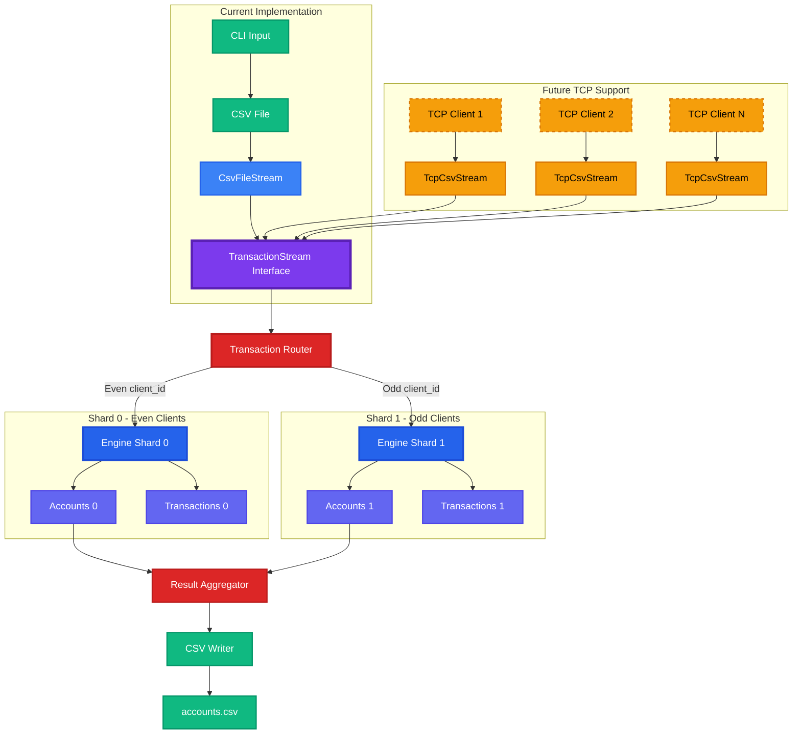

# Transaction Processing Engine

A simple payment transaction processing engine that reads CSV transactions, manages client accounts, and handles disputes and chargebacks.

## Usage

```bash
cargo run -- transactions.csv > accounts.csv
```

## Architecture

The system consists of several key components:

- **Ledger**: Main transaction processing engine that manages client accounts
- **ClientAccount**: Individual account state with balance tracking and transaction history
- **Transaction Types**: Deposit, Withdrawal, Dispute, Resolve, Chargeback
- **CSV Processing**: Flexible parsing with error handling for malformed data

## Key Features

- **Decimal Precision**: All monetary amounts use 4 decimal places with banker's rounding
- **Account Safety**: Prevents overdrafts and maintains account invariants
- **Dispute Handling**: Complete dispute resolution workflow including chargebacks
- **Error Resilience**: Graceful handling of malformed CSV data and invalid operations
- **Memory Efficiency**: Uses `FxHashMap` for O(1) client lookups and transaction tracking

## Assumptions

### Transaction Processing
- **Only available funds are allowed for withdrawal** (`src/ledger.rs:113`): Withdrawals that exceed available balance are ignored
- **Resolved transactions can be disputed again in the future** (`src/ledger.rs:143`): After a dispute is resolved, the transaction becomes disputable again
- **All amounts in the CSV are correctly formatted with 4 decimal places** (`src/ledger.rs:205`): The system expects properly formatted decimal inputs

### Data Handling
- **Duplicate transaction IDs are silently ignored**: If a transaction ID already exists (either as disputable or disputed), new transactions with the same ID are ignored
- **Zero or negative deposit/withdrawal amounts are ignored**: The system only processes positive amounts for deposits and withdrawals
- **Invalid CSV rows are silently skipped**: Malformed CSV data doesn't stop processing; it's simply ignored
- **Whitespace is automatically trimmed**: CSV parser handles whitespace around values

### Account Management
- **Transactions on locked accounts are ignored**: Once an account is locked due to chargeback, all subsequent transactions are ignored
- **Client accounts are created on-demand**: New client IDs automatically create new accounts
- **Account balances never go negative**: Withdrawal requests exceeding available funds are rejected

### Business Logic
- **Transaction IDs are globally unique**: Transaction IDs are unique across all clients, not per-client
- **Disputes only apply to deposits**: Only deposit transactions can be disputed (withdrawals cannot be disputed)
- **Chargebacks immediately lock accounts**: Any chargeback permanently locks the client account
- **Disputes must exist before resolution/chargeback**: Resolve and chargeback operations require the transaction to be in disputed state

### Technical Implementation
- **Banker's rounding is used for all calculations**: Uses `MidpointNearestEven` rounding strategy for decimal operations
- **Single-threaded processing**: No explicit synchronization mechanisms for concurrent access
- **Memory-resident processing**: All data is kept in memory during processing
- **4 decimal place precision**: All monetary amounts maintain exactly 4 decimal places

## Testing Strategy

The codebase includes comprehensive testing:

- **Unit Tests**: Individual component functionality testing
- **Integration Tests**: Complete transaction flow testing  
- **Property-Based Tests**: Randomized testing to verify invariants always hold
- **Precision Tests**: Decimal rounding and precision handling verification
- **Edge Case Tests**: Error conditions and boundary value testing

Key invariants tested:
- `available = total - held`
- `total >= 0`, `held >= 0`
- `available >= 0` (unless account is locked)

## LLM-Assisted Coding

This project utilized AI assistance during development:

- **Commits marked with (LLM)**: Code was purely generated by Claude AI
- **Commits marked with (LLM+) or (+LLM)**: Initial draft generated by LLM, then manually modified
- **Tab completion**: Cursor AI was used extensively for boilerplate code, particularly in unit test writing

This approach allowed for rapid development while maintaining code quality through human review and modification.

## Error Handling

The system handles various error conditions gracefully:

- **Malformed CSV data**: Invalid rows are skipped, processing continues
- **Missing files**: Clear error messages for file not found
- **Invalid transaction references**: Non-existent transaction IDs in disputes/resolves/chargebacks are ignored
- **Insufficient funds**: Withdrawal attempts exceeding available balance are ignored
- **Duplicate transactions**: Duplicate transaction IDs are silently ignored

## Performance Considerations

- **O(1) client lookups**: Uses `FxHashMap` for fast client account access
- **O(1) transaction history**: Efficient dispute/resolve tracking per client
- **Memory streaming**: CSV reader processes data incrementally
- **Minimal allocations**: Efficient data structures for large transaction volumes

## Future Improvements

### Scalability
- **Database persistence**: Move from in-memory to persistent storage for large datasets
- **Streaming processing**: Implement true streaming for very large CSV files
- **Concurrent processing**: Add support for parallel transaction processing
- **Partitioning**: Implement client-based partitioning for horizontal scaling

#### Streaming Architecture for TCP Support

The current implementation uses a TransactionStream trait abstraction that makes it trivial to extend from file-based processing to handling thousands of concurrent TCP streams. The architecture already includes:

- **Async-first design**: Built on Tokio for non-blocking I/O operations
- **Stream abstraction**: Generic TransactionStream trait allows easy addition of new input sources (TCP, WebSocket, Kafka, etc.)
- **Concurrent-ready state**: Uses RwLock for thread-safe account access with optimized read/write patterns
- **Chunked processing**: Simulates network-like behavior with configurable chunk sizes and backpressure handling

To add TCP support, simply implement the TransactionStream trait for TcpStream and the engine seamlessly handles concurrent connections without any changes to the core processing logic. This design allows horizontal scaling where each TCP connection processes its transactions independently while maintaining global account consistency through the shared state layer. The trait itself is also a future enhancement.



### Robustness
- **Transaction logging**: Add audit trail for all operations
- **Explicit error reporting**: Replace silent failures with configurable error handling
- **Data validation**: Add stronger validation for transaction amounts and client IDs
- **Idempotency**: Ensure operations can be safely retried

### Features
- **Multiple currencies**: Support for different asset types
- **Transaction limits**: Implement daily/monthly transaction limits
- **Account types**: Support for different account types with varying rules
- **Batch operations**: Support for batch transaction processing
- **Real-time processing**: WebSocket or event-driven transaction processing

### Observability
- **Metrics collection**: Add prometheus metrics for transaction volumes and processing times
- **Structured logging**: Replace println with proper structured logging
- **Health checks**: Add system health and status endpoints
- **Performance monitoring**: Track processing latency and throughput

### Security
- **Input sanitization**: Enhanced validation of CSV input data
- **Rate limiting**: Prevent abuse through excessive transaction submissions
- **Audit logging**: Comprehensive audit trail for compliance
- **Encryption**: Support for encrypted transaction data

### API & Integration
- **REST API**: HTTP API for real-time transaction submission
- **WebSocket support**: Real-time transaction streaming
- **Message queue integration**: Support for Kafka/RabbitMQ integration
- **Export formats**: Support for multiple output formats (JSON, XML, etc.)

### Code Quality
- **Configuration management**: Externalize configuration (decimal precision, limits, etc.)
- **Error types**: More specific error types for better error handling
- **Documentation**: Enhanced API documentation and examples
- **Benchmarking**: Performance benchmarks for large datasets